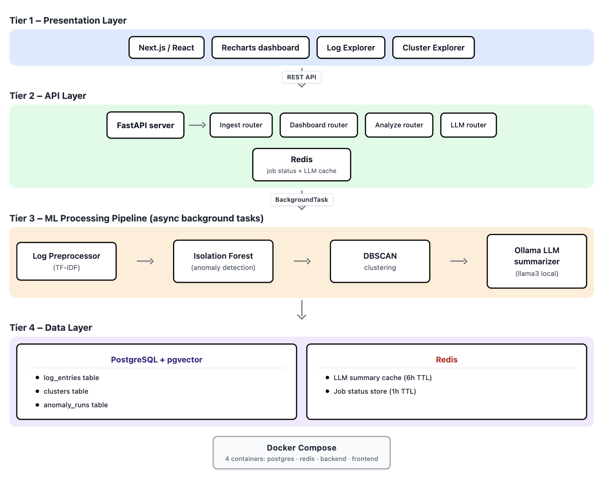

# LogSense AI

**AI-powered log intelligence for SRE teams.**
Detect anomalies, cluster related errors, and get plain-English root cause summaries — all running locally.

## What It Does

- Ingests structured JSON logs via REST API
- Detects anomalous log patterns using Isolation Forest
- Groups similar errors using DBSCAN clustering
- Generates plain-English root cause summaries using a local LLM (Ollama)
- Answers natural-language questions about the logs (RAG) — grounded in retrieved
  log lines, and able to say "not enough information" instead of guessing
- Ships a full evaluation harness that measures retrieval and answer quality (see [Evaluation](#evaluation))
- Displays everything in a professional SRE dashboard

## Quick Start

git clone https://github.com/Dhevdharsan/Logsense-ai.git
cd Logsense-ai
docker compose up --build

Then load sample data:
python3 scripts/generate_sample_logs.py --count 500

Open http://localhost:3000

## Tech Stack

- Backend: FastAPI + Python 3.11 + SQLAlchemy (async)
- Database: PostgreSQL 16 + pgvector extension
- Cache: Redis 7
- ML: scikit-learn (Isolation Forest + DBSCAN + TF-IDF)
- LLM: Ollama (runs locally, no API key needed)
- Frontend: Next.js 14 + TypeScript + Tailwind + Recharts

## Architecture

## API Reference

Interactive docs at http://localhost:8000/docs

Key endpoints:
- POST /api/v1/logs/ingest        Submit logs
- GET  /api/v1/logs               Browse logs
- POST /api/v1/analyze/run        Trigger ML pipeline (also writes embeddings + saves the vectorizer)
- GET  /api/v1/dashboard/summary  Dashboard stats
- GET  /api/v1/clusters           View clusters with AI summaries
- POST /api/retrieve              Retrieve top-k relevant log chunks (IDs only, no LLM)
- POST /api/query                 Ask a question; grounded answer + the retrieved context used

## ML Pipeline

Raw Logs -> TF-IDF Vectorize -> Isolation Forest -> DBSCAN -> LLM Summary
                                  (anomaly score)  (clusters)  (cached 6hr)

The pipeline also persists each log's TF-IDF embedding and saves the fitted
vectorizer, so the RAG query path can embed a question into the same space and
cosine-search pgvector.

## RAG Query Path

Question -> TF-IDF embed (saved vectorizer) -> pgvector cosine top-k -> Ollama (grounded, abstention-aware) -> Answer + cited log lines

## Evaluation

The RAG path is measured by a harness in [`eval/`](eval/) that keeps two things
separate: **retrieval quality** (deterministic, no LLM) and **answer quality**
(claim-level LLM-as-judge). Baseline run (judge: `gpt-4o-mini`):

| Layer | Result |
|---|---|
| Retrieval | Hit@5 **60%**, MRR 0.60 (single-chunk precision **92%**) |
| Generation | Faithfulness **99%**, hallucination **2.5%** |
| Abstention | Correct **67%** on unanswerable questions |
| Judge trust | Gwet's AC1 **0.92** (validated against 39 hand-labeled claims) |

Retrieval and generation are kept separate on purpose: it localizes failure
(low faithfulness + high recall = a generator problem; low recall + high
faithfulness = a retrieval problem). A key finding is that aggregation and
multi-hop questions fail structurally under top-k retrieval — the answer lives in
no single chunk — which is a case for a hybrid retrieval path, not a bigger model.

Full write-up in [eval/RESULTS.md](eval/RESULTS.md); how to run it in [eval/README.md](eval/README.md).

## Week-by-Week Build

| Week | Goal                                          | Status |
|------|-----------------------------------------------|--------|
| 1    | Docker, DB schema, ingest API, dashboard      | Done   |
| 2    | ML pipeline: anomaly detection + clustering   | Next   |
| 3    | Ollama LLM integration + cluster summaries    | Soon   |
| 4    | Frontend polish + anomaly views               | Soon   |

## Running Locally Without Docker

Terminal 1 - infrastructure:
docker compose up postgres redis

Terminal 2 - backend:
cd backend
pip install -r requirements.txt
uvicorn app.main:app --reload

Terminal 3 - frontend:
cd frontend
npm install
npm run dev
