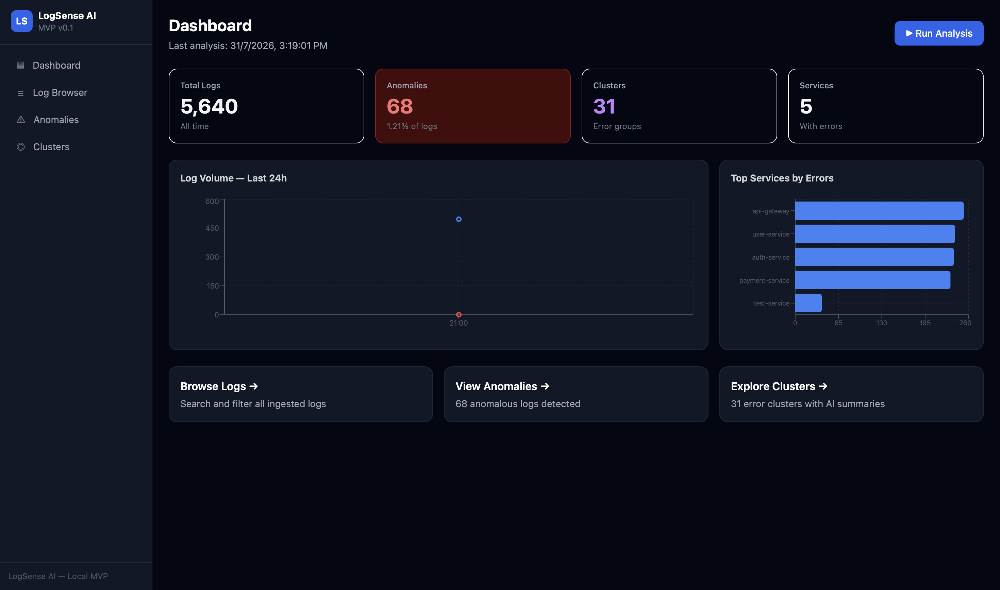
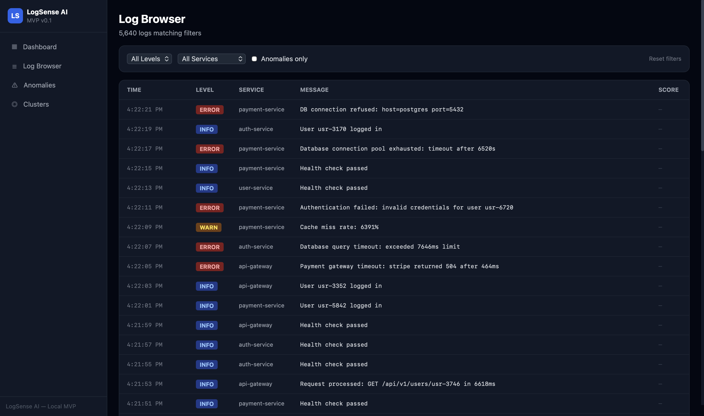
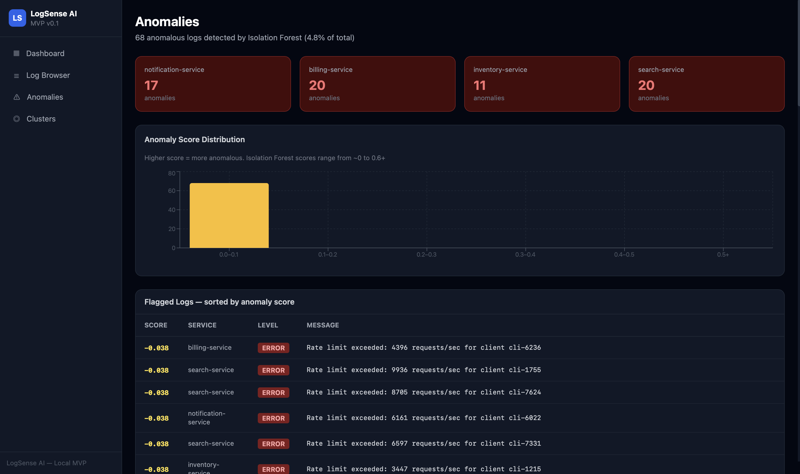
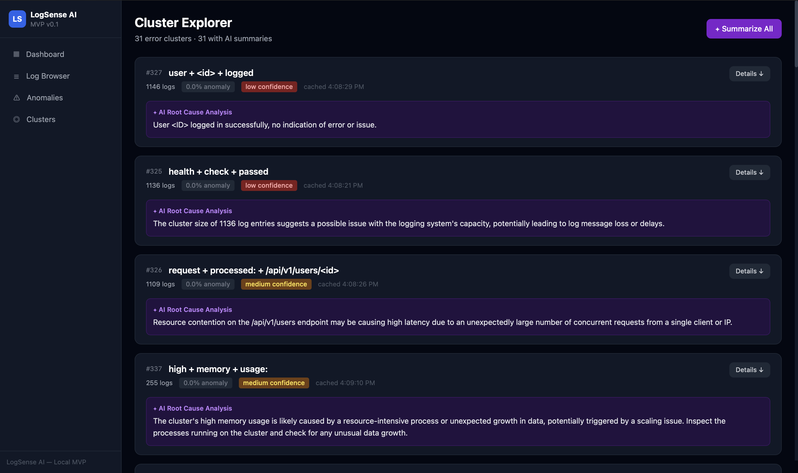
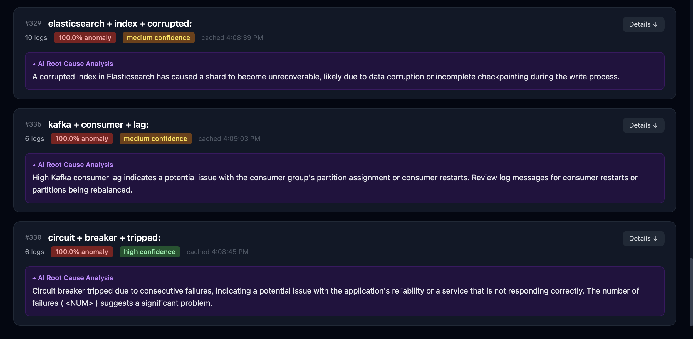

# LogSense AI

**AI-powered log intelligence for SRE teams.**
Ingest structured logs, surface the ones that actually matter, group related
errors together, and get a plain-English root-cause explanation for each
group — all running locally, with a natural-language query interface on top.


---

## What It Does

- **Ingests** structured JSON logs via a REST API
- **Flags anomalies** using Isolation Forest, refined with a frequency-based
  cluster-rarity signal and an absolute-floor threshold (so a single noisy
  service can't dominate the anomaly list)
- **Groups related errors** using DBSCAN clustering over TF-IDF log embeddings
- **Explains each cluster** in plain English using a local LLM (Ollama) —
  cached for 6 hours so repeat views are instant
- **Answers natural-language questions about the logs (RAG)** — grounded in
  retrieved log lines, and able to say "not enough information" instead of
  guessing
- **Ships a full evaluation harness** that measures retrieval quality and
  answer quality independently (see [Evaluation](#evaluation))
- **Displays everything** in a professional, dark-mode SRE dashboard

---

## Screenshots

### Dashboard
At-a-glance health: total logs, anomaly count, cluster count, and services
with errors, plus a 24h volume chart and top offending services.



### Log Browser
Search and filter every ingested log by level, service, or anomaly status.



### Anomalies
All flagged logs sorted by Isolation Forest anomaly score, broken down by
service, with a score-distribution chart.



### Cluster Explorer
DBSCAN-grouped error clusters, each with an AI-generated root-cause summary.



### AI Root Cause Analysis
A closer look at the generated explanations — grounded, specific, and cached
per cluster.



---

## Tech Stack

| Layer | Technology |
|---|---|
| Backend | FastAPI + Python 3.11 + SQLAlchemy (async) |
| Database | PostgreSQL 16 + pgvector extension |
| Cache | Redis 7 |
| ML | scikit-learn (Isolation Forest + DBSCAN + TF-IDF) |
| LLM | Ollama (`llama3.2:3b`, runs locally — no API key needed) |
| Frontend | Next.js 14 + TypeScript + Tailwind CSS + Recharts |

---

## Quick Start

```bash
git clone https://github.com/Dhevdharsan/Logsense-ai.git
cd Logsense-ai
docker compose up --build
```

Then load sample data:

```bash
python3 scripts/generate_sample_logs.py --count 500
```

Open **http://localhost:3000**.

> Ollama must be running locally (`ollama serve`) with the `llama3.2:3b` model
> pulled for cluster summaries and the `/api/query` endpoint to work. Without
> it, ingestion, anomaly detection, and clustering still function — you just
> won't get AI-generated summaries or answers.

## Running Locally Without Docker

```bash
# Terminal 1 - infrastructure
docker compose up postgres redis

# Terminal 2 - backend
cd backend
pip install -r requirements.txt
uvicorn app.main:app --reload

# Terminal 3 - frontend
cd frontend
npm install
npm run dev
```

---

## Architecture

```
Raw Logs -> TF-IDF Vectorize -> Isolation Forest -> DBSCAN -> LLM Summary
                                  (anomaly score)  (clusters)  (cached 6hr)
```

The pipeline persists each log's TF-IDF embedding to pgvector and saves the
fitted vectorizer to disk, so the RAG query path can embed a new question
into the same vector space and cosine-search against it.

```
Question -> TF-IDF embed (saved vectorizer) -> pgvector cosine top-k -> Ollama (grounded, abstention-aware) -> Answer + cited log lines
```

**Anomaly detection** combines Isolation Forest's per-log anomaly score with a
per-cluster rarity percentage and an absolute-floor threshold — a cluster only
gets flagged if it's both statistically rare *and* small enough in absolute
terms to plausibly be a real anomaly rather than a large-but-normal pattern.

---

## API Reference

Interactive docs at **http://localhost:8000/docs**.

| Method | Endpoint | Description |
|---|---|---|
| `POST` | `/api/v1/logs/ingest` | Submit logs |
| `GET` | `/api/v1/logs` | Browse logs |
| `POST` | `/api/v1/analyze/run` | Trigger the ML pipeline (also writes embeddings + saves the vectorizer) |
| `GET` | `/api/v1/dashboard/summary` | Dashboard stats |
| `GET` | `/api/v1/clusters` | View clusters with AI summaries |
| `POST` | `/api/retrieve` | Retrieve top-k relevant log chunks (IDs only, no LLM) |
| `POST` | `/api/query` | Ask a question; returns a grounded answer + the retrieved context used |

---

## Evaluation

The RAG path is measured by a harness in [`eval/`](eval/) that keeps two
things separate: **retrieval quality** (deterministic, no LLM) and **answer
quality** (claim-level LLM-as-judge). Baseline run (judge: `gpt-4o-mini`):

| Layer | Result |
|---|---|
| Retrieval | Hit@5 **60%**, MRR 0.60 (single-chunk precision **92%**) |
| Generation | Faithfulness **99%**, hallucination **2.5%** |
| Abstention | Correct **67%** on unanswerable questions |
| Judge trust | Gwet's AC1 **0.92** (validated against 39 hand-labeled claims) |

Retrieval and generation are kept separate on purpose: it localizes failure
(low faithfulness + high recall = a generator problem; low recall + high
faithfulness = a retrieval problem). A key finding is that aggregation and
multi-hop questions fail structurally under top-k retrieval — the answer lives
in no single chunk — which is a case for a hybrid retrieval path, not a bigger
model.

Full write-up in [eval/RESULTS.md](eval/RESULTS.md); full changelog for the
RAG + eval work in [CHANGES.md](CHANGES.md); how to run the harness yourself
in [eval/README.md](eval/README.md).

---

## Project Structure

```
backend/
  app/
    routers/     ingest, dashboard, analyze, llm, query
    services/     ingest, ML pipeline, LLM summaries, RAG retrieval
    ml/           preprocessor, anomaly detector, clusterer, vectorizer store
    models/       SQLAlchemy models (log_entry, cluster)
    schemas/      Pydantic request/response schemas
frontend/
  app/            Dashboard, Log Browser, Anomalies, Clusters (Next.js App Router)
  components/     charts, dashboard widgets, UI primitives
eval/             retrieval + generation evaluation harness, golden set, results
scripts/          sample log generators, DB init SQL
```

---

## Week-by-Week Build

| Week | Goal | Status |
|------|------|--------|
| 1 | Docker, DB schema, ingest API, dashboard | Done |
| 2 | ML pipeline: anomaly detection + clustering | Done |
| 3 | Ollama LLM integration + cluster summaries | Done |
| 4 | Frontend polish + anomaly views | Done |
| 5 | RAG query path + evaluation harness | Done |
